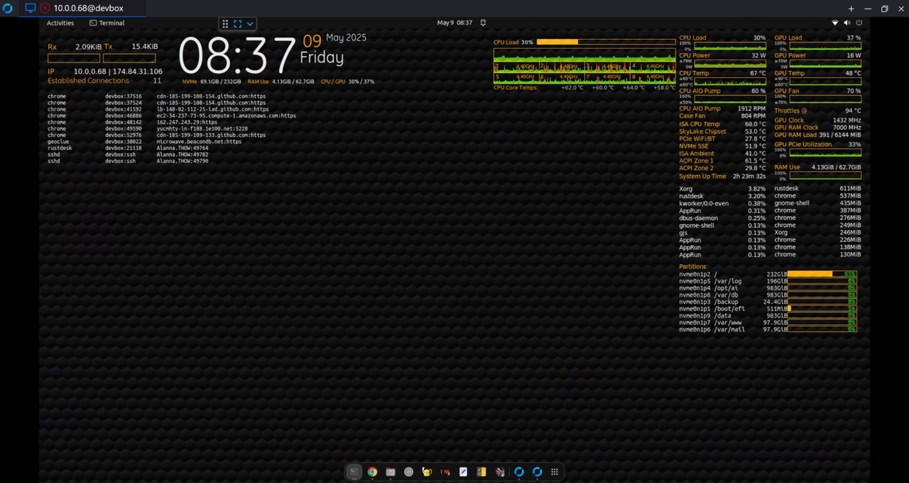

# MHz_conky_widgets
A collection of conky config files and supporting scripts.

These are implemented on an Ubuntu 22.04 machine that I built from an old circa 2015-ish box (Dell Precision Tower 3420 SFF, i7-6700, 16G RAM, 1TB SATA).  It was a $150 refurb'd machine I bought some years ago for the mother in law.  She passed and the box was collecting dust.

I got into AI and decided that I wanted to build a stand-alone AI server.  Got a NVIDIA Jetson AGX Orin 64GB Dev Kit and a 4TB NVMe to use for the OS vs the 64GB eMMC.  Then I decided that I needed a devbox to use with the Jetson Orin as the target.  So, as I contemplated this, peeps on Discord (NVIDIA types) suggested that the dev machine should have the same OS and similar hardware.

That took me down a path that I found quite interesting these past weeks.  I upgraded RAM to 64GB, installed a 4TB NVMe, installed a WiFi7 PCIe NIC with BT (that was a PITA that imputed an eventual kernel upgrade), and, to have the same family as the Orin, I installed a NVIDIA RTX-3050 (single slot w/ 6GB, as the chassis is uber small and I didn't have the space or a proper-sized card).  Then I yanked the i7-6700 and installed a Xeon E3 1285 v6.  That is a processor from the same family as the i7-6700 - compatible with the chipset on the MoBo, etc.  So I installed it and heeded the suggestions that the package power is higher than the i7 (79w vs. 65w), I went with an aftermarket chip-cooler.  Initially I tried the Noctua NH-L12 Ghost.  While that was better than the Dell chip cooler that came with the i7-6700 in the machine, I felt it didn't provide enough cooling head room, so this past week, I upgraded to my first ever liquid cooling on a PC (yes, really, and I am old AF, been messing with boxes since the TRS-80/Commodore 64/TI 99-4A - just never was really a gamer and hadn't ever drank the liquid cooling bug juice).  Anyways, I settled on a Fractal Design Celsius S24 BKO 120x240 AIO. Now the system's cooling performance is acceptalbe.  I've had to acquiese to no longer having the chassis cover installed, as the plumbing on the AIO just doesn't support cover reinstallation in this SFF chassis.  I posit that the franken build is drawing close to being ready for starting to build out the tool chain for dev on the Orin.

So, as I was looking at system monitoring stuffs (the Orin has jtop (akin to htop)) and I wanted something to allow me to have widgets on the desktop to monitor the devbox, especially during build and running of the binaries/AI models (because I am a geek and I want to be in the know).  This eventually led me to conky.  These wip widgets are the result.  I've learned about the Journal, Syslog, etc. and a lot of other shite.  It's been quite a learning curve to have to traverse, and I think I am still in the foot hills.  Oh well, such is the pursuit of an endeavor of passion. 

Sample Images:

Muh frakenbox:

